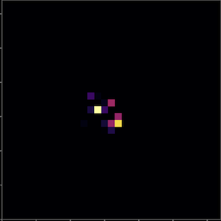

# Jet Sonification

Different data sonification techniques provide an alternate way of presenting data over traditional data visualization. Here, we look at a pre-processing method and audio conversion method for hadronized jet images that generate a "characteritic sound" for any standard jet image.

## The Process

Data inputs are "jet images", which are a 32x32 grid of cells, each of which containing the jet energy in that cell

We can convert any image to sound using reverse audio spectrogram analysis (i.e. mapping pixel values vertical position to audio frequencies). Remove the large amounts of black space around the center, flattening the matrix and transposing gives us a vertical 1D vector.

Then, using the [img-encode script](https://github.com/alexadam/img-encode), this image can be converted to an audio file.

## Results

Sonification results can be seen in our [Keynote presentation](sonify_jets.key).